# curso-kafka:.

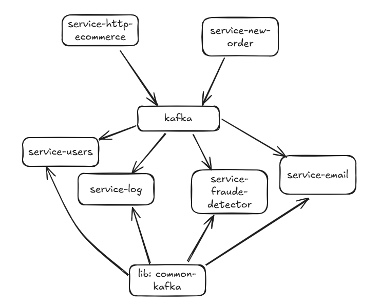 <br>

## Anotações gerais:.

````
Consumer = Consome a mensagem
orderDispatcher.send = Posta a mensagem no topico
Podemos armazenar as mensagens com erro ou tentar novamente
Importar os projetos como Maven
Armazenando enquanto processa é um problema, precisamos saber se tem dependência de outro processo
kafka = Topico
zookeeper = Gerencia os topicos kafka
````

## Configuration o Kafka:.

````
$ docker pull apache/kafka:4.0.0
$ docker run -p 9092:9092 apache/kafka-native:4.0.0

Adicionei o arquivo docker-compose.yml no projeto, ele já utiliza o zookeeper tb (Sugiro rodar esse)
$ docker compose up

Comandos:
$ docker ps
$ docker exec -it kafka-produto bash
$ cd /opt/kafka/bin
$ kafka-topics.sh --describe --bootstrap-server localhost:9092 (Descreve os topicos rodando)
$ kafka-server-start.sh config/server.properties (Inicia o topico)
$ cp config/server.properties config/server2.properties
$ ci config/server2.properties
$ bin/kafka-server-start.sh config/server2.properties (Inicia o topico 2)
$ pwd -> apps/kafka_2.12-2.3.1
$ bin/zookeeper-server-start.sh config/zookeeper.properties
$ bin/kafka-server-start.sh config/server.properties
$ bin/kafka-server-start.sh config/servers.properties
$ bin/kafka-topics.sh --describe --bootstrap-server localhost:9092
$ bin/kafka-topics.sh --describe --bootstrap-server localhost:9093
````

## Configuration o banco sqlite:.

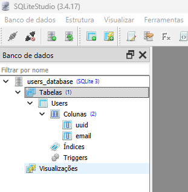 <br>
Criar o banco na pasta target/users_database.db com ajuda do sqlitestudio <br>
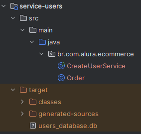 <br>
Apontar corretamente a pasta target do start do projeto<br>
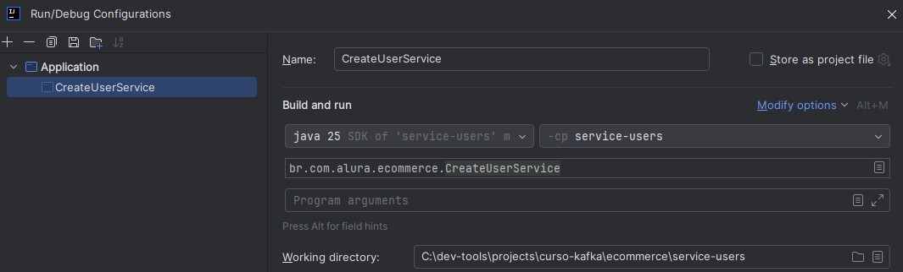 <br>
Quando roda o createUserService pela primeira vez ele cria a tabela, depois comentar.
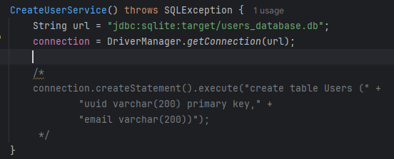 <br>

## Criando um novo serviço:.

````
Representa um banco de usuários - service-users - banco sqlite 3.28.0
Acessar o banco e fazer algo
SQLite - Muito utilizado para pocs (Não precisa rodar no container)

#Criar banco de dados na pasta target/users_database.db
Baixar o sqlite studio -> https://sqlitestudio.pl/
Baixar offset explorer (Ler os topicos) -> https://www.kafkatool.com/download.html
````

## Testando:.

````
Rodar:
CreateUserService (Grava os usuarios no banco de dados)
FraudeDetectorService (Topico que processa as nova ordens)
LogService (Loga as mensagens)
EmailService (Envia o email para o usuário)

NewOrderMain (Gera 10 ordens) <- Ultimo (Quando os outros estiverem rodando)
HttpEccomerceService <- Para receber as requests via get no Browser
````

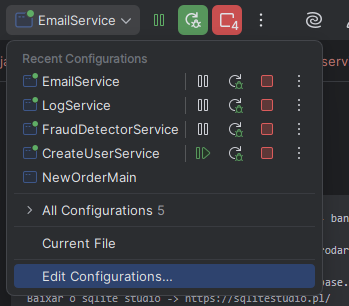 <br>

## Interação de um serviço web com o Kafka:.

````
Utilizei o jetty para ser simples - https://jetty.org/
doGet - Get que estamos acostumados
localhost:8080/new  <- Chama nossa API
localhost:8080/new?email=gustavocarvalho.ti@gmail.com&amount=153  <- Chama nossa API
````

## Fast delegate:.

````
Quanto menos codigo no HTTP mais facil de replicar
Colocar minimo de processamento possível
````

## Single point of failure do broker:.

````
Cada consumer group consume simultaneo de acordo com o numero de partições
3 partições = 3 consumers
O que acontece com os topicos se o Kafka cai? 
O broker é unico, as aplicações reclamam das conecções com a porta 9092
O Broker volta e os apps conseguem reconectar
Se um service cai o outro assume, como fazer isso para os Brokers?
Como levantar 2 broquers kafka?
Mudar o broker.id=2 (Colocar 2 porque o nome do nosso server é server2.properties)
Mudar o log.dirs=/user.../1552-kafka2/apps/data/kafka (Mudar para 2 tb)
Mudar listeners=PLAINTEXT://:9093 (Fazer o incremento)

Quando o Leader: 0 cair precisa ir para a replica
$ bin/kafka-topics.sh --zookeeper localhost:2181 --alter --topic ECOMMERVE_NEW_ORDER --partitions 3 --replication-factor 2 (Ver a foto abaixo, precisa add antes) 
````

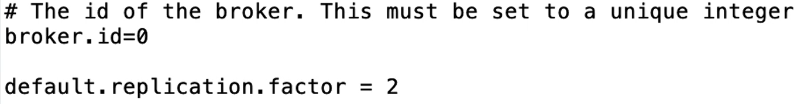 <br>Adicionar essa propriedade nos 2 brokers <br>

## Apagando os dados do diretorio

````
$ rm -fr ../data/
$ rm -fr ../data/kafka/*
$ rm -fr ../data/zookeeper/*
````

## Conectando no topico com o offiset explorer

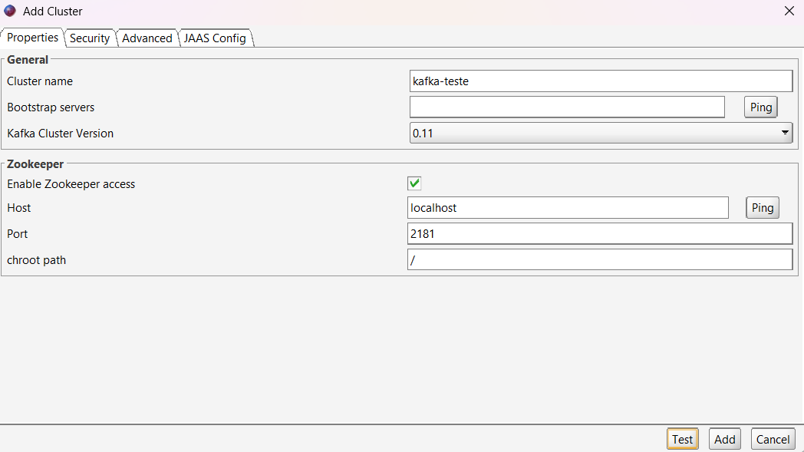 <br>

## Definição basica dos topicos

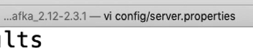 <br>
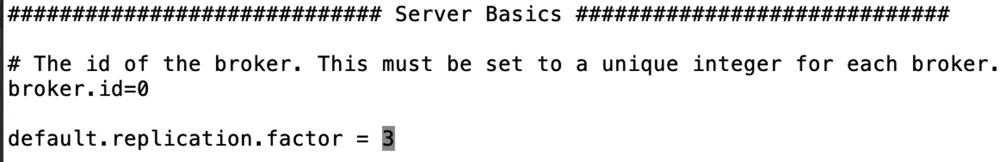 <br>
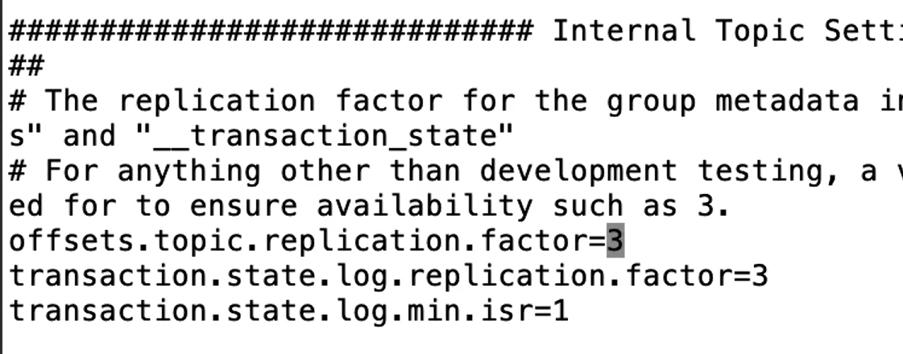 <br>
4 Brokers <br>
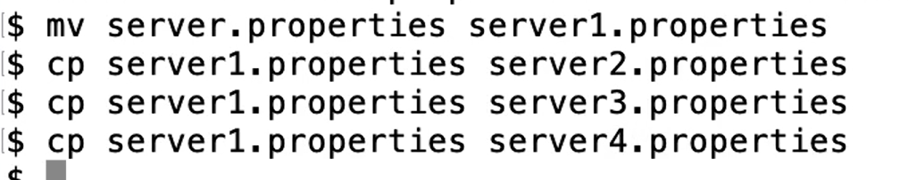 <br>
Mudar de todos: broker.id, logs.dirs, listeners (Mudar a porta) <br>
Pode apagar os diretorios que ele cria sozinho <br>
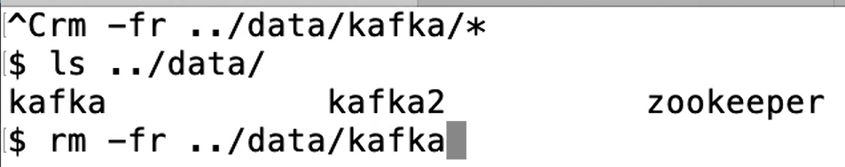 <br>
Logs do Zookeeper <br>
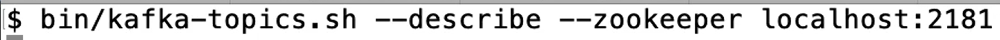 <br>
Os leader são escolhidos automaticamente <br>
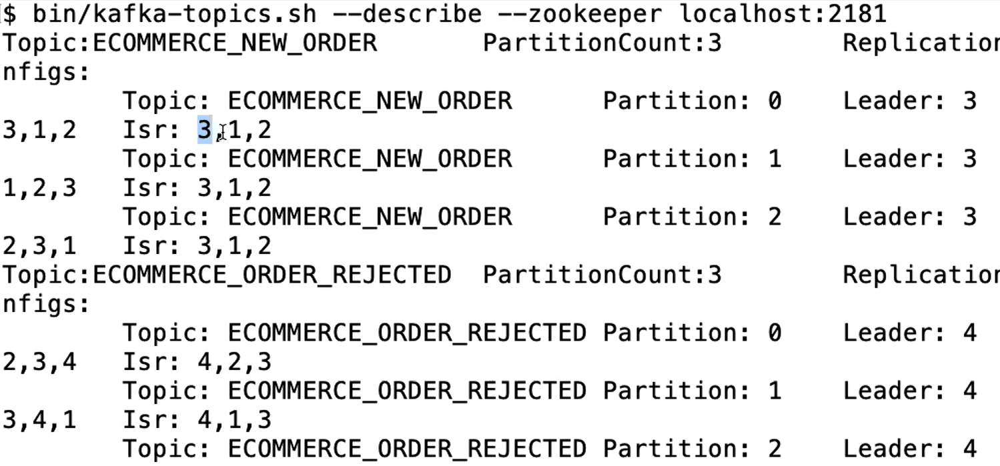 <br>

## Acks e reliability

Imagine que enviamos a mensagem e temos cinco máquinas rodando o cluster. Quatro delas saíram do ar e nós enviamos a
mensagem. A mensagem chega nessa única e não replicou ainda. O que acontece?

Antes da máquina levantar e poder replicar, essa máquina cai e perde os arquivos. Em seguida, outra máquina levanta, ou
seja, ela está com um estado antigo, não com um estado novo, porque não deu tempo de a máquina que caiu enviar as
informações para a réplica.

Estamos com réplica 3, então independentemente de ter cinco máquinas, a réplica é 3. Outra situação é a máquina líder
receber a mensagem, porque o write é sempre para o líder.

Então, mandamos a mensagem para o líder, o líder escreve e informa que está ciente. Em seguida, mandamos replicar. Com
isso, o líder avisa que já escreveu e irá mandar replicar.

Nós assumimos que já foi escrita a mensagem e alguém poderá consumi-la. Porém, nesse meio tempo, o líder cai. Até está
escrito no disco do líder, mas ele não sincronizou com as réplicas. Assim, as réplicas não ficaram sabendo da mensagem
que chegou. O que acontece agora?

Daqui a pouco, essas réplicas percebem que o líder está fora do ar e uma delas vira líder, com as mensagens antigas, sem
a nova mensagem.

Citamos duas situações: uma em que as réplicas caíram e o servidor logo depois; e outra em que o líder caiu e as
réplicas se tornaram líderes sem ter as informações mais recentes, porque quando enviamos a mensagem em
NewOrderServlet.java, na linha 40, chamamos um get() em KafkaDispatcher.java.

0 = Não se preocupa - não retenta <br>
1 = O leader escreve no log local e não espera as replicas (Se as replicas não pegaram a informação se perde) <br>
all = Ele espera todas as replicas darem OK para confirmar o recebimento da mensagem <br>

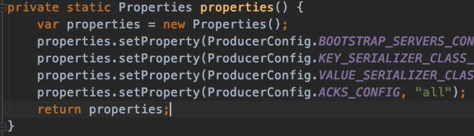 <br>
Quando um serviço cai precisa levantar outro rápido <br>
